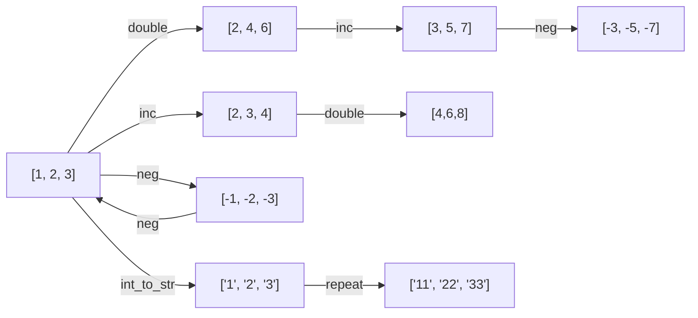

# Wandering Light

[](https://github.com/abhishekraok/wandering-light/actions/workflows/python-package.yml)
[](https://opensource.org/licenses/Apache-2.0)

[](https://github.com/psf/black)
[](https://github.com/astral-sh/ruff)

A Python library for tool call mastery through self play. 

Given a set of functions (tool calls), we generate input output examples from these and then train an LLM 
to predict the correct list of functions that can map the inputs to the outputs (AKA Induction task). 
The library also supports training the LLM for generating appropriately challenging input outputs (AKA proposal task). 


## Features

 - Scripts for SFT and RL on Induction and Proposal tasks using the TRL library.
 - Synthetic data generation using LLMs.
 - Wandb integration for monitoring and analyzing the metrics.
 - Versioned basis sets with verified-solution function usage tracking.
 - Evaluation scripts, website to visualize the evaluation metrics.
 - Clean code: 300+ unit tests, CI using Github actions.
 - Can train small models (0.1B) locally within a few hours.

## Motivation
Currently LLMs are trained to imitate text on the internet. 
As a result they do not know what they know and do not know, which causes hallucination. 
They lack a world model (See Sutton's [age of experience](https://storage.googleapis.com/deepmind-media/Era-of-Experience%20/The%20Era%20of%20Experience%20Paper.pdf)). 
Instead of next token prediction we would like a training approach that lets models take action and learn from its outcome. 
We call this self supervised tool-use learning (SSTL).
We can consider function calling or tool use as taking an action.
We also want a task that is infinitely scalable for learning, bound only by computation. 
Programming by Example (PBE) provides such an environment, where the model is tasked to find a series of functions that transforms a given inputs to outputs. 

We would like to develop some **meta cognition capabilities** in the model.
Given any task the model should be able to classify it into one of these 3 possibilities. 

  1. Confidently say it can solve this
  2. Confidently say it cannot solve this
  3. Unsure

This lets it keep learning boundlessly in the future by exploring the unsure tasks. 
A value function in the RL paradigm should help with this.

### The tasks 
Let us assume each state represents a list of values (e.g. the integers [1,2,3]).
Using the naming convention of [Absolute Zero Reasoner](https://github.com/LeapLabTHU/Absolute-Zero-Reasoner)



**Induction**
We would like to train a solver model that can give us the shortest path between two states ([1,2,3] -> [3,5,7]) 
A path is defined as a DAG consisting of pure functions (e.g. double, plus1). 
Currently the functions take only one input and output only a single output for simplicity.
In the future we would like to expand to multiple argument functions to make this library more practical.

**Propose**
Propose a new task for the solver, that is not too easy and not too hard. 

## Results

**Induction.** Best solver to date is `abhishekraok/induction-basicfns-opt125m-sft434k-rl-6k-with-lp`
— an OPT-125M base, SFT'd and then RL'd with GRPO under a length penalty. It scores **84.0 %** on
`random_inputs_500_shortest_v1` (480 certified specs) and **85.5 %** on `random_inputs_500` (496
specs), both at budget 1. A solve counts when executing the predicted function list reproduces the
target output; the path need not match the reference one.

**Proposal.** Best proposer to date (`abhishekraok/proposer-basicfns-opt125m-sft2k`, scored against
the solver above) reaches 0.96 parse rate and 0.15 solver success rate, but only **31 %** of
generated groups have non-zero reward standard deviation — the other ~69 % give GRPO no gradient at
all.

**Basis functions.** Basis sets are immutable and content-addressed. A pilot generated 84K
trajectories, measured 72K with the default solver, and recorded 62K function calls across 31K
verified solutions. See the [basis-function report](reports/basis-library-20260815/README.md).

Training curves and RL runs are in
[WandB](https://wandb.ai/abhishekraok-na/wandering-light-rl_proposer/reports/Initial-Wandering-Light-project-report--VmlldzoxNjExOTQ3Mg?accessToken=21hou3g702spnui44p3bn1arsplg4t0m0yvbcrchn9hfe8b6gdzn8ncq8wpe5721).

## Installation
This project requires python 3.12 or later. We use [uv](https://docs.astral.sh/uv/) for reproducible environments — the committed `uv.lock` pins every transitive dependency.

```bash
git clone https://github.com/abhishekraok/wandering-light.git
cd wandering-light
uv sync --extra dev           # installs main deps + test/lint tools
```

Then either activate the venv (`source .venv/bin/activate`) or prefix commands with `uv run`.

<details>
<summary>Don't have uv? Fallback with pip</summary>

```bash
python3 -m venv .venv && source .venv/bin/activate
pip install -e ".[dev]"
```
Note: pip won't respect `uv.lock`, so transitive versions may drift.
</details>

## Testing

Run the full test suite with:

```bash
uv run pytest
```
# Code

- `FunctionDef`: Class for immutable functions e.g. double.
- `TrajectorySpec`: Represents planned sequences of functions without execution e.g. [double, plus1].
- `Trajectory`: Class representing triplet of inputs, outputs and function sequences e.g. [(1,2,3), (3,5,7), (double, plus1)].
- Execute trajectories and evaluate results with `Executor` class.
- Several solvers included:
  - **RandomSolve**: tries random function sequences within a budget.
  - **BFSSolve**: performs breadth-first search up to a maximum depth.
  - **LLM solvers**: use OpenAI, Gemini, Ollama or local models to propose functions.

## Project Structure

```
.
├── wandering_light/        # Main package
│   ├── __init__.py         # Package initialization
│   ├── executor.py         # Executes individual functions and trajectories
│   ├── function_def.py     # Defines the FunctionDef class
│   ├── common_functions.py # Built-in helper functions
│   ├── trajectory.py       # Defines TrajectorySpec and Trajectory classes
│   ├── solver.py           # Implements search-based solvers
│   ├── typed_list.py       # Typed list container
│   ├── llm_utils.py        # LLM integration utilities
│   ├── constants.py        # Project constants
│   ├── evals/              # Evaluation scripts and workflows
│   ├── webapp/             # FastAPI API + React explorer (frontend/ builds to static/)
│   └── training/           # Training scripts (SFT, RL)
├── tests/                  # pytest test cases for core functionality
├── pyproject.toml          # Project configuration and dependencies
├── pytest.ini              # pytest configuration
└── README.md               # This file
```

## Usage

### Solving for an input output pair
You can search for a trajectory that maps a specific input to an output using one of the built-in solvers.
```python
from wandering_light.solver import get_solver_by_name

solver = get_solver_by_name("bfs", budget=3)
trajectory = solver.solve(input_list=[1, 2, 3], output_list=[3, 5, 7])
print("Found trajectory:", trajectory)
```

## Evaluation
Create an evaluation file 
```bash
python wandering_light/evals/create_data.py --save
```

Run using an LLM API
```bash
python wandering_light/evals/run_evaluation.py --eval_file=evals/data/eval_data_v20250831_160239.py --solver_names=["gemini"] --num_samples 100 --budget 1
```
See `solver.py` for additional solver names (openai, ollama, local models, etc.).


## Training SFT
Quick check, without online evaluation
```bash
python wandering_light/training/sft.py --no-eval
```

To train on the full dataset, use
```bash
python wandering_light/training/sft.py --full-run 
```
Suppose you store the output dir to SFT_OUTPUT_DIR, evaluate to ensure you have a decent success rate (between 30-70% ideally).
You can use the evaluation command below.

Next you can do RL.

## Training RL
```bash
python wandering_light/training/rl_grpo.py --batch-size 32 --model-name $SFT_OUTPUT_DIR --full-run --wandb-run-name $NAME
```

### Evaluate local trained LLM 
Assuming you have a checkpoint shown below.
```bash
python wandering_light/evals/run_evaluation.py --budget=1 --eval_file=wandering_light/evals/data/random_inputs_500.py  --solver_names=[trained_local] --budget 1 --model-name abhishekraok/induction-basicfns-opt125m-longsft
```

### Evaluation Dashboard
To see the results of all the past evaluations run
```bash
streamlit run wandering_light/evals/dashboard.py
```

## Explorer (browser app)

An interactive explorer for states, trajectories and the trajectory graph:
build the frontend once, then run the server.

```bash
cd wandering_light/webapp/frontend && npm install && npm run build && cd -
PYTHONHASHSEED=0 python -m wandering_light.webapp
```

Then open <http://127.0.0.1:8765>. For frontend work, `npm run dev` serves a
hot-reloading copy on port 5173 that proxies `/api` to the Python server.

What it is for:

- **Edit a trajectory by clicking its edges.** Every function in the picker
  shows the state it would actually produce from that point, including the ones
  that fail here and the ones that change nothing. Replacing an edge drops the
  steps downstream of it and re-runs the rest.
- **Grow one graph, rather than replacing a picture.** The canvas accumulates
  everything you visit or expand, merged by state, so `inc` then `dec` closes a
  two-cycle and `abs` on positives closes a self-loop. Editing the trajectory
  draws on it immediately; *clear canvas* returns it to your path alone.
- **Expand from whichever node you select**, with the set of functions you
  choose and self-loops kept or dropped. Nodes are draggable and stay where you
  put them across later expansions.
- **See how far the basis reaches.** The panel reports which types an expansion
  reached and how many basis functions produced no edge at all — the concrete
  version of "is anything missing".
- **Feel the solver's problem.** Run BFS or random search against your target
  and watch what it costs; the answer stays hidden behind a *reveal* until you
  ask, so you can try the task yourself first by walking the graph.
- **Start from real data.** The corpus tab loads any task from a local corpus
  as root and target, witness included.

### Visual checks

Rendering bugs survive every unit test — an edgeless graph, a stretched control
panel and a blank minimap all passed jsdom and the API tests. To look at the
page without a desktop browser (WSL included):

```bash
npx playwright install chromium
python -m wandering_light.webapp &
node wandering_light/webapp/frontend/scripts/screenshot.mjs /tmp/shots
```

It walks the app — picker, graph, solver, corpus, basis — writes a PNG per step
and reports any console error.

The server holds no session state — every request carries the state it acts on,
so reloading or duplicating a tab loses nothing.

## Data explorer (Streamlit)
The older Streamlit app, still the best view of corpus-level statistics and past runs:

```bash
PYTHONHASHSEED=0 streamlit run wandering_light/evals/explorer.py
```

The seed is needed only for the checkpoint-era basis (`wl-core-pyhash-v1`),
which the eval and solver tabs load.

| Tab | What it shows |
|---|---|
| Corpus | Manifest headline for `deep_corpus_v1`, its certified-distance distribution next to the older relabelled eval data, and a filterable task browser. |
| Playground | A corpus task or a hand-typed input/output pair: edit the function list, watch every intermediate state recompute, and run BFS or random search against the target. |
| Graph | Budgeted breadth-first `TrajectoryGraph` expansion from one state, drawn as a graph with the shortest path to any node highlighted. |
| Basis | Any registered basis set, its function code, and — per function — how often a corpus uses it as a witness step or an optimal first action. |
| Eval file / Solver run / Proposer run | The original trajectory-tree views over eval files and past run JSON. |

Corpus payloads live on the Hub, not in git. The Corpus tab shows a download
button when the split files described by a committed manifest are not on disk;
it verifies every digest before use. Equivalently:

```bash
python -c "from wandering_light.corpus_hub import fetch_corpus; fetch_corpus('wandering_light/training/data/deep_corpus_v1/manifest.json')"
```

## Proposer
The data generator.
First finetune it using SFT, using the `--task proposer` flag. Then evaluate it.

### Evaluate proposer
```bash
 python wandering_light/evals/evaluate_proposer.py --model abhishekraok/proposer-basicfns-opt125m-sft2k --solver-model abhishekraok/induction-basicfns-opt125m-longsft
```
which should output
```python
EvalResult(parse_rate=0.96, avg_function_count=2.02, avg_function_count_ratio=1.38, solver_success_rate=0.15, num_samples=100, frac_non_zero_std=0.31)
```
