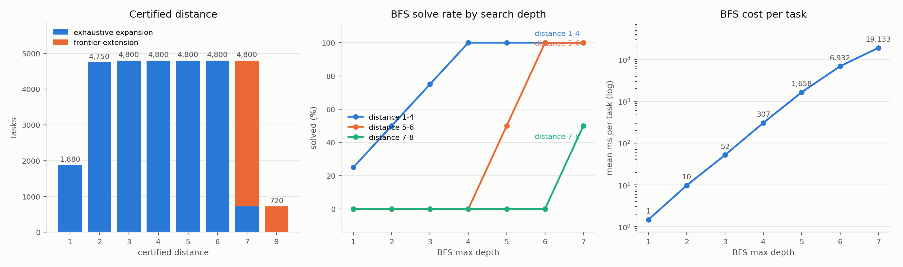

# A corpus with long certified shortest paths

Date: 2026-08-16

## Summary

Every task in `random_inputs_500_shortest_v1` is trivially reachable: its
certified distances are 183 at 1, 201 at 2, 87 at 3, 9 at 4, and nothing
beyond. Any solver comparison on it is a tie at the ceiling.

This corpus is generated **forward** instead. `TrajectoryGraph.expand` runs a
complete breadth-first expansion from each root, and a node first reached at
depth `k` is certified at distance `k` by construction — no search, no
relabelling, no separate certification pass.

| | |
|---|---:|
| Tasks | 31,350 |
| Roots | 240 |
| Certified distance 6 | 4,800 |
| Certified distance 7 | 4,800 |
| Certified distance 8 | 720 |
| States expanded | 40,697,654 |
| Expansion wall clock | 93 min |
| Witnesses re-executed, failures | 31,350, **0** |
| BFS cost to fail at depth 6 / 7 | 17.6 s / 59.2 s per task |

For contrast, BFS solves `random_inputs_500_shortest_v1` 100% at depth 4 in
8 ms per task. Here it solves 75% at depth 6 and 87.5% at depth 7, and the
tasks it misses cost it a full exhaustive sweep to miss.

**Kill-criterion verdict: not triggered.** The issue said to stop and report if
depth >= 6 tasks could not be produced in quantity. All 240 roots reached
certified depth 6; 36 reached certified depth 7. The corpus carries 10,320
tasks at distance >= 6, distributed across all twelve input types and all
three splits. The DSL poses the question comfortably.

## Method

Layers `0..D` of an expansion are complete, so the set of reached states is
exactly the set of states within distance `D`. Two things follow:

1. A node first reached at depth `k <= D` is at shortest distance exactly `k`.
2. A state produced in one more step from a depth-`D` node and **absent** from
   the reached set is at distance exactly `D + 1`.

Point 2 is the frontier extension. Sampling the frontier keeps the proof
intact — absence from a complete set is still absence — and costs only
completeness of the optimal-action labels, which are flagged per record with
`optimal_first_actions_complete: false`.

Optimal first actions come from bitmask reachability over the shortest-path
DAG: action `a` is optimal at distance `d` iff `dist(f_a(s), target) == d - 1`,
and every such distance is already in the expansion.

Records are `BasisTaskRecord` in the `basis_dataset` format, storing the
resolved basis ID and digest and stable `basis_function_id`s rather than list
positions. Splits are **by root**: every task from one root shares that root's
split, so no two splits can share a source state.

## Three bugs found while generating

All three were found by the pipeline's own checks or by auditing them, and all
three are fixed in this branch.

### Signed zero merged distinct search states

Expansion and BFS both keyed visited states on Python numeric equality, under
which `-0.0 == 0.0`. The basis disagrees: `float_to_str`, `f_fraction` and
`f_sin` all distinguish the two. Merging them left one state's successors
unexplored, so a target reachable only through `-0.0` was either missed or
found later by a longer path and **labelled with an inflated distance** — the
exact claim this corpus exists to make.

Generation hit this on root 106, a `complex` root whose frontier-extension
witness reconstructed `[419904, 324, 324]` for a target recorded as
`[419904, 1024, 1024]`: the path ran through `str(0.0) == "0.0"` where the
stored state held `str(-0.0) == "-0.0"`, three characters against four.

The fix separates two notions that were conflated. `canonical_key` and
`__eq__` keep Python equality, which is the right question to ask of a
solver's output. A new `TypedList.search_key` is used wherever a state is
*pruned* — the trajectory graph and `BFSPredictor` — and there two states may
be merged only if no basis function can tell them apart. NaNs stay collapsed in
both: no basis function observes a NaN's sign or payload, and they are not
equal to themselves.

The BFS half matters for the reference curve below. Unsound pruning can make
BFS miss solutions that exist, which would have understated the baseline —
the wrong direction for a number every learned arm is compared against.

### Frontier candidates were grouped by the same coarse key

Found by auditing the remaining `canonical_key` call sites after the fix above.
The frontier extension collected candidate successors into a dict keyed on
`canonical_key`, so `0.0` and `-0.0` merged into one entry. That entry keeps
the first state as its value — the witness stays correct, which is why witness
verification passed — but its mask and in-edges accumulate from both states'
parents, and those become the optimal first and last action labels. The label
would then name actions that reach the other state.

Anywhere a state is deduplicated, the key has to be one no basis function can
see through.

**The shipped corpus is unaffected.** Replaying the frontier sampling of this
run across all 240 roots — 24 sampled parents each, every basis function
applied — found **0 candidate keys where two distinct states collided**. The
bug was reachable in principle but never fired here, so the corpus was not
regenerated for it.

### Held-out splits were biased by input type

Root index determined both the input type (period 12) and the split (cycle
length 9). Because `gcd(9, 12) = 3`, each split could only ever draw four
types: validation got `complex`, `dict`, `float` and `list`, test got `bytes`,
`range`, `str` and `tuple`, and `int`, `bool`, `set` and `bytearray` never
left discovery.

Root-level leakage was still prevented, but the held-out sets differed from
discovery *by input type* rather than only by root — bad for a benchmark every
learned arm gets scored on. The split cycle is now walked per input type and
offset by the type, so every type walks the whole cycle. The ratio is
unchanged at 188/26/26 roots; all three splits now cover all twelve types.

## Distance histogram

| split | roots | tasks | 1 | 2 | 3 | 4 | 5 | 6 | 7 | 8 |
|---|---:|---:|---:|---:|---:|---:|---:|---:|---:|---:|
| discovery | 188 | 24,498 | 1,467 | 3,711 | 3,760 | 3,760 | 3,760 | 3,760 | 3,760 | 520 |
| validation | 26 | 3,427 | 208 | 519 | 520 | 520 | 520 | 520 | 520 | 100 |
| test | 26 | 3,425 | 205 | 520 | 520 | 520 | 520 | 520 | 520 | 100 |
| **all** | **240** | **31,350** | **1,880** | **4,750** | **4,800** | **4,800** | **4,800** | **4,800** | **4,800** | **720** |

Distances 1 and 2 fall short of the per-root quota because small shells run out
of candidates that survive the filters, not because of any budget.

How each distance was certified:

| distance | exhaustive layer | frontier extension | total |
|---:|---:|---:|---:|
| 1-6 | 25,830 | 0 | 25,830 |
| 7 | 720 | 4,080 | 4,800 |
| 8 | 0 | 720 | 720 |

Distance 7 is exhaustive for the 36 deep roots and by extension for the other
204. Distance 8 is entirely frontier extension, from the deep roots' complete
depth-7 layer.

## Root and type coverage

Twenty roots per input type, drawn by the broad generator from
`experiments/basis_library_pilot.py`: boundary and large numbers, Unicode and
structured strings, binary values, larger containers, stepped ranges.

| input type | discovery | validation | test | total |
|---|---:|---:|---:|---:|
| `builtins.bool` | 2,012 | 264 | 244 | 2,520 |
| `builtins.bytearray` | 1,983 | 243 | 264 | 2,490 |
| `builtins.bytes` | 1,920 | 271 | 396 | 2,587 |
| `builtins.complex` | 2,059 | 270 | 249 | 2,578 |
| `builtins.dict` | 1,843 | 386 | 387 | 2,616 |
| `builtins.float` | 2,159 | 272 | 271 | 2,702 |
| `builtins.int` | 2,173 | 275 | 275 | 2,723 |
| `builtins.list` | 2,093 | 257 | 276 | 2,626 |
| `builtins.range` | 2,043 | 248 | 268 | 2,559 |
| `builtins.set` | 1,900 | 392 | 267 | 2,559 |
| `builtins.str` | 2,225 | 280 | 278 | 2,783 |
| `builtins.tuple` | 2,088 | 269 | 250 | 2,607 |

## Dedup and rejections

States are deduplicated structurally during expansion, and tasks again
globally on `sha256(canonical_input, canonical_output)`.

| rejection | count |
|---|---:|
| `effective_identity_in_edges` | 1,924 |
| `constant_output_example` | 1,642 |
| `value_identity_task` | 81 |
| `duplicate_task_id` | 0 |
| `unserializable_state` | 0 |

An *effective identity* is a transition whose item values equal its parent's,
so only the declared type changed; a target reachable only through such edges
is not a real task. Zero duplicate task IDs is expected rather than lucky:
roots are drawn distinct and each root's states are already unique.

Self-loops are skipped during expansion, 18,787,398 of them. A further
2,511,169 transitions raised and were treated as absent edges.

## Expansion cost

| certified depth | roots | mean states | mean seconds | total seconds |
|---:|---:|---:|---:|---:|
| 6 | 204 | 129,440 | 17.1 | 3,487 |
| 7 | 36 | 396,998 | 54.5 | 1,963 |

States by BFS layer. Layers 1-6 are summed over all 240 roots; layer 7 comes
only from the 36 deep roots, so it is not comparable to the column before it.

| layer | 1 | 2 | 3 | 4 | 5 | 6 | 7 (36 roots) |
|---|---:|---:|---:|---:|---:|---:|---:|
| states | 2,085 | 16,511 | 108,353 | 665,144 | 4,007,321 | 24,026,122 | 11,871,878 |

Growth settles at almost exactly 6x per level (7.9x, 6.6x, 6.1x, 6.0x, 6.0x
across layers 2 through 6) with no sign of saturation: the reachable set is
still expanding freely at the point where the corpus stops. All 240 roots ran
to completion with no budget
binding (`stop_reason: None` for every root), at `--max-states 600000
--max-transitions 2500000`, raised to 1,200,000 / 8,000,000 for the 36 deep
roots.

Branching is strongly type-dependent, which is why the deep-root budget is
restricted to the nine cheaper types:

| input type | mean states | mean seconds |
|---|---:|---:|
| `builtins.float` | 415,709 | 53.1 |
| `builtins.complex` | 316,303 | 40.5 |
| `builtins.int` | 233,009 | 30.3 |
| `builtins.list` | 188,949 | 24.9 |
| `builtins.str` | 181,445 | 25.8 |
| `builtins.range` | 170,868 | 22.0 |
| `builtins.set` | 148,861 | 21.2 |
| `builtins.bytes` | 99,881 | 14.0 |
| `builtins.dict` | 90,580 | 12.2 |
| `builtins.tuple` | 84,970 | 11.7 |
| `builtins.bytearray` | 60,470 | 8.5 |
| `builtins.bool` | 43,838 | 8.4 |

Measured on a desktop i9-9900KF, 16 threads, 54 GB, single process.

## Optimal first actions

| split | mean | median | max | complete labels |
|---|---:|---:|---:|---:|
| discovery | 1.11 | 1 | 9 | 20,738 / 24,498 |
| validation | 1.09 | 1 | 9 | 2,907 / 3,427 |
| test | 1.09 | 1 | 6 | 2,905 / 3,425 |

**This is worth flagging for #33.** The mean optimal first-action set has just
over one element and the median is exactly one: for almost every task there is
a single correct first move. A policy trained with a set-valued target will
mostly see a one-hot target. Labels are complete for the tasks drawn from
exhaustive layers and partial for the frontier-extension tasks at the top two
distances, where only a sample of the frontier was expanded.

## BFS reference curve

This is the number every learned arm in #33 gets compared against. The solver
is the one the repository ships, via `create_bfs_solver`, so its budget
accounting is included. The sample is 96 tasks drawn from **validation and
test only**, twelve at each distance 1 through 8, with a 20,000,000-trajectory
budget.

| BFS max depth | solved / 96 | solve rate | mean ms/task | median ms/task | total s |
|---:|---:|---:|---:|---:|---:|
| 1 | 12 | 12.5% | 1 | 1 | 0 |
| 2 | 24 | 25.0% | 10 | 8 | 1 |
| 3 | 36 | 37.5% | 52 | 40 | 5 |
| 4 | 48 | 50.0% | 307 | 179 | 29 |
| 5 | 60 | 62.5% | 1,658 | 657 | 159 |
| 6 | 72 | 75.0% | 6,932 | 701 | 665 |
| 7 | 84 | 87.5% | 19,133 | 732 | 1,837 |

Broken out by certified distance, the result is exactly lower-triangular:

| BFS depth | 1 | 2 | 3 | 4 | 5 | 6 | 7 | 8 |
|---:|---:|---:|---:|---:|---:|---:|---:|---:|
| 1 | 12/12 | 0/12 | 0/12 | 0/12 | 0/12 | 0/12 | 0/12 | 0/12 |
| 2 | 12/12 | 12/12 | 0/12 | 0/12 | 0/12 | 0/12 | 0/12 | 0/12 |
| 3 | 12/12 | 12/12 | 12/12 | 0/12 | 0/12 | 0/12 | 0/12 | 0/12 |
| 4 | 12/12 | 12/12 | 12/12 | 12/12 | 0/12 | 0/12 | 0/12 | 0/12 |
| 5 | 12/12 | 12/12 | 12/12 | 12/12 | 12/12 | 0/12 | 0/12 | 0/12 |
| 6 | 12/12 | 12/12 | 12/12 | 12/12 | 12/12 | 12/12 | 0/12 | 0/12 |
| 7 | 12/12 | 12/12 | 12/12 | 12/12 | 12/12 | 12/12 | 12/12 | 0/12 |

BFS at depth `d` solves every task at certified distance `<= d` and **not one
task beyond it**. That is a third independent check on the labels, and the
sharpest one: an inflated distance label would show up immediately as a task
solved at a shallower depth than its label claims.

The cost that matters is the **failed** search, because that is what a solver
pays when it cannot reach the target:

| BFS depth | 1 | 2 | 3 | 4 | 5 | 6 | 7 |
|---|---:|---:|---:|---:|---:|---:|---:|
| mean ms on unsolved tasks | 2 | 12 | 70 | 530 | 3,422 | 17,569 | 59,231 |

That is roughly 5-6x per level, reaching about a minute per task at depth 7.
The median cost per task barely moves from depth 5 onward (657 -> 701 -> 732
ms) while the mean grows 12x: the distribution is entirely bimodal, cheap
successes against expensive exhaustive failures.

The 20,000,000-trajectory budget never bound. Re-running three distance-8
tasks at depth 7 with a 200,000,000 budget reproduced the same failures in the
same time (38.7 / 103.8 / 19.0 s against 38.3 / 103.8 / 19.3 s), so BFS is
exhausting the depth-7 space rather than running out of budget. Those failures
are therefore proofs in their own right: a completed depth-7 search that does
not find the target establishes distance > 7, which together with the recorded
length-8 witness pins those tasks at exactly 8.

**What this means for #33.** There is real headroom. Distance 7 and 8 tasks
cost BFS 17.6 and 59.2 seconds respectively to fail, and reaching them
exhaustively costs a full level of 6x growth each. A learned policy that
proposes even a shortlist of good first actions converts that exhaustive sweep
into a handful of executions. The corresponding numbers on
`random_inputs_500_shortest_v1` are a tie at the ceiling: BFS solves it 100% at
depth 4 in 8 ms per task.



## Verification

`--mode verify` re-executes every witness in the corpus and, with
`--recertify`, re-proves a sample of distances from scratch. Re-certification
is independent of the generation run: it expands a **fresh** graph from the
task's own input through `distance - 1` and requires the target to be absent,
which is exactly the lower-bound half of the distance claim.

| check | result |
|---|---|
| Records checked | 31,350 |
| Witness re-execution failures | 0 |
| Witness length != certified distance | 0 |
| Unknown or mismatched function IDs | 0 |
| Roots leaking across splits | 0 |
| Independent re-certifications | 48 |
| Re-certifications that found a shorter path | 0 |
| Overall | **ok: true** |

The re-certification sample covers all eight distances, six tasks each. Its
cost is itself informative — proving a distance-8 label means exhausting depth
7:

| certified distance | expanded to depth | mean states searched | mean seconds |
|---:|---:|---:|---:|
| 1 | 0 | 1 | 0.0 |
| 2 | 1 | 6 | 0.0 |
| 3 | 2 | 64 | 0.0 |
| 4 | 3 | 276 | 0.0 |
| 5 | 4 | 3,719 | 0.5 |
| 6 | 5 | 8,866 | 1.2 |
| 7 | 6 | 135,843 | 19.8 |
| 8 | 7 | 399,822 | 67.1 |

Every one of those expansions ran to completion, so each absence is a proof
rather than a budget exhaustion.

Full output: [`verification.json`](verification.json).

## Artifacts

Corpus at `wandering_light/training/data/deep_corpus_v1`, basis `wl-core-v1`,
digest `sha256:ffc602fb24db249df7eb4f6b0d5ba38d5a5070b2c68c6c5f94c7f387de682494`,
seed 20260816, manifest digest
`sha256:a56246fb26801bdf56ae1b1a6e9359f76d86c49e00826489363c5261417d8c54`.

- `discovery.jsonl.gz` — 24,498 tasks,
  `sha256:1497fbd164a6648d949c0767c0f66ea539be7df34ff59216d53df84b3b5f1c39`
- `validation.jsonl.gz` — 3,427 tasks,
  `sha256:b62149e38b85ddfa7cccc715799f0027d503a54deeccdd46028f9286c75365f6`
- `test.jsonl.gz` — 3,425 tasks,
  `sha256:ca68c9723afbc3daf845b5dfa38dd3495606d10a7af15542643bb8b7c04c5478`
- `manifest.json` — full per-root record, including every root's certified
  depth, stop reason, shell sizes and rejection counts.
- [`verification.json`](verification.json) — witness re-execution and
  independent re-certification results.
- [`bfs_curve.json`](bfs_curve.json) — the reference curve, depths 1 through 7.
- [`deep_corpus.png`](deep_corpus.png) — the three panels above.

Reproduce with `experiments/generate_deep_corpus.py`; the exact invocations are
in the manifest `config` block. Generation:

```
uv run python -m experiments.generate_deep_corpus --mode run \
  --roots 240 --max-depth 6 --max-states 600000 --max-transitions 2500000 \
  --deep-roots 36 --deep-max-depth 7 --deep-max-states 1200000 \
  --deep-max-transitions 8000000 \
  --deep-root-types builtins.bool,builtins.list,builtins.tuple,builtins.set,\
builtins.dict,builtins.bytes,builtins.bytearray,builtins.complex,builtins.range \
  --tasks-per-distance 20 --frontier-sample 24 \
  --output-dir wandering_light/training/data/deep_corpus_v1 --overwrite
```

The reference curve was sharded by depth across three processes and the `curve`
arrays merged; the sample depends only on seed, splits and
`--curve-tasks-per-distance`, so the rows are comparable.

## Limits

- Distance is certified against `wl-core-v1` only. A different basis is a
  different metric.
- The two deepest distances of each root rest on the frontier-extension
  argument. That argument certifies the distance exactly, but the
  optimal-action sets there are partial by construction.
- Roots are 240 draws from a broad generator; per-type behaviour beyond the
  twelve supported types is untested.
- The certified datasets from PR #26 were generated before the signed-zero fix,
  so they were re-certified under the fixed key: every certified record, 480 in
  `random_inputs_500_shortest_v1` and 118,730 in `induction_shortest_v1`, by
  expanding a fresh graph from each input through `distance - 1` and looking
  for the output. **0 inflated labels and 0 inconclusive expansions.** Their
  distances are short enough (max 4 and 5) that shortest paths stay off the
  signed-zero states. They need no regeneration.
