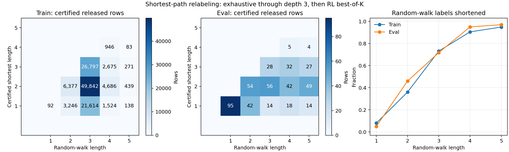

# Certified shortest-path data v1

## Result



| split | source | valid | certified | identity excluded | unresolved excluded | released |
|---|---:|---:|---:|---:|---:|---:|
| train | 121,100 | 120,430 | 120,379 | 1,649 | 51 | 118,730 |
| eval | 500 | 496 | 493 | 13 | 3 | 480 |

The random-walk label was shortened for 71.55% of valid train rows and 62.70% of valid eval rows (including identities, which are excluded from release). All released trajectories were independently re-executed from the compressed files: 118,730/118,730 train and 480/480 eval loaded successfully.

The RL solver was called only for unresolved length-5 tasks: best-of-16 certified 13/64 train tasks and 0/3 eval tasks. The remaining tasks retain a `[4, 5]` shortest-length interval in the raw audit and are not released.

## Certification

1. Execute the random walk to obtain a valid upper bound `L`; reject failures and identities.
2. Exhaustively search through depth `min(3, L-1)`. No search hit plus upper bound `L <= 4` proves the original path shortest.
3. For `L=5` with no depth-3 hit, test the five ordered length-4 subsequences, then call the local length-penalized RL solver. A validated length-4 witness meets the BFS lower bound and is exact.
4. Exclude every row without equal lower and upper bounds.

No BFS resource cap fired. Search covered 11,645,297 train states / 28,254,636 transitions and 98,756 eval states / 286,155 transitions.

## Artifacts

- Release: [`induction_shortest_v1.jsonl.gz`](../../wandering_light/training/data/induction_shortest_v1.jsonl.gz), SHA-256 `70657508702bf96f98478a9970738e74ede4609655e6cf330c024cd4e2b30175`
- Release: [`random_inputs_500_shortest_v1.jsonl.gz`](../../wandering_light/evals/data/random_inputs_500_shortest_v1.jsonl.gz), SHA-256 `cc1dcfa1ffd418c5b4a48480f010354964cda7445bab3e0d6fb3c5e350db18c4`
- Full evidence, including invalid/unresolved rows: [`raw/`](raw/)
- Machine-readable metrics/config: [`summary.json`](summary.json)
- Plot: [`shortest_relabel.svg`](shortest_relabel.svg)

Training accepts the release with:

```bash
uv run python -m wandering_light.training.sft \
  --task induction \
  --induction-data-file wandering_light/training/data/induction_shortest_v1.jsonl.gz
```

The eval wrapper is `wandering_light.evals.data.random_inputs_500_shortest_v1`.

## Caveats and fixes

- The historical 434k SFT corpus was not persisted. Train v1 reconstructs the current checked-in generator (`{1:100, 2:10k, 3:100k, 4:10k, 5:1k}`, seed/shuffle 42), not that historical corpus.
- `str_hash`, `set_hash`, and `set_to_list` depended on Python hash/iteration state. They now use SHA-256-derived integers and canonical set ordering; legacy eval specs are normalized to this current palette.
- The token solver previously ignored `budget`. It now generates `K` candidates, executes each, and returns the shortest valid one; tests cover best-of-K selection.
- Only the local RL checkpoint was used. SFT, W&B, HF Hub, and remote inference were not used.
